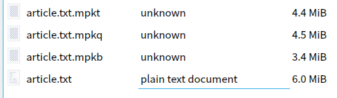
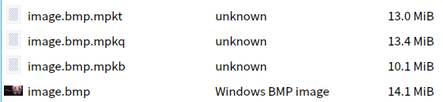

# moonpack - 基于 huffman 编码的数据压缩

## 编译与使用

moonpack 使用 qmake 构建系统，编译的典型流程如下：

```shell
mkdir build && cd build && qmake .. && make
```

编译后的可执行文件为 `build/moonpack`.

在 `bin` 目录有预编译的 32 位 windows 可执行文件和 64 位 linux 可执行文件，并包含了测试中使用的文章和图片。

使用帮助如下（也可以使用 `moonpack -h` 查看）：

```shell
moonpack - A simple huffman based compressing program.
Usage: moonpack [-xbtq] -i infile -o outfile
	-i infile: input file.
	-o outfile: output file.
	-x: Decompress instead of compressing.
	-b: Use binary huffman encoding (default).
	-t: Use ternary huffman encoding.
	-q: Use quinary huffman encoding.
	-h: Display this help message.
```

一个用于测试正确性的用例如下：

```shell
moonpack -i infile -o outfile && ./moonpack -x -i outfile -o infile.restored && md5sum infile infile.restored
```

期望的结果是两者哈希值相同。

## 实现细节

### 二元 huffman

二元 huffman 的存储十分单纯，本程序选择了逐字节进行频率统计并编码的方式。moonpack 的头信息如下：

- 4 bytes 头标识：4d 50 4b 42 (即 ASCII 字符串 MPKB (moonpack binary) )。

- 头信息：

  ```c
  typedef struct bin_huffman_head {
      size_t data_size; // 原文件的字节数。
      size_t dict_count; // 字典条目数。
      char reserved[8]; // 选项字段，目前没有用。
  } bin_huffman_head_t;
  ```

- 字典条目段包含 `dict_count` 个如下条目：

  ```c
  typedef struct bin_huffman_head_dict {
      unsigned char byte; // 对应的字节
      u_int64_t bit_length; // 编码后的比特数
      u_int64_t bits[4]; // 编码后的比特，高位比特对应编码的低位比特。
      // 最坏情况下，huffman 编码可能将一个字节编码为 256 比特。
  } bin_huffman_head_dict_t;
  ```

  之后便是编码的数据部分。

编码流程：


解码流程：


解码时读取数据使用了状态机。即将状态指针置于重建后的树根，每读取到一个比特便转移到左或右子节点，当转移到一个叶节点便向输出文件流输出一个字节，（同时重置状态指针）。

### 三元与五元 huffman

三元与五元 huffman 与二元 huffman 完全类似，但在实现时有一些差异：

- 储存二进制的计算机如何表达三元比特或五元比特：

  以三元为例，如果 $x$ 二元比特能完美表达 $y$ 个三元比特，则一定有：
  $$
  2^ x - 3^y = 0
  $$
  在 $x$ 与 $y$ 为整数时，这不可能。

  定义比特的平均浪费数如下：
  $$
  W_3 = \frac{2^x - 3^y}{2^{x}xy}
  $$
  例如，用 2 个比特表达一个三元比特，2 个比特可以表达四个值，而一个三元比特可以表达三个值，用两个比特表达一个三元比特损失了一个值，则整体来看，我们损失了 2 比特能表达的值的 $1/4$，对每个比特，我们损失了其能表达的值的 $1/8$，则
  $$
  W = \frac{1}{8}
  $$
  

  显然，为了减小冗余量，我们希望 $W$ 尽可能小。

  虽然不会证，但大量实践结果表明选取的 $x$ 越大，并选取 $y$ 是使 $W > 0$ 的最大的 $y$，$W$ 便越小。

  为了代码的清晰易懂，moonpack 采用了最简单的储存方式：以 2 个比特储存一个三元比特，其中 $00, 01, 10$ 分别是三元比特的 $0, 1, 2$，出现 $11$ 则为错误。这带来的浪费量是最大的，因此 moonpack 的三元 huffman 实现实际上是一个上界情况：其他编码若干个三元比特为多个二元比特的方式不可能比这种情况还差了。一个可行的改动是使用 4 字节表达 20 个三元比特，这时 $W = 0.0003$，几乎可以忽略。

  五元的情况完全类似，区别仅仅在于此时平均浪费数如下：
  $$
  W_5 = \frac{2^x - 5^y}{2^{x}xy}
  $$
  对五元的情况， moonpack 采用以 3 个比特存储一个五元比特的方式（这依然是上界情况），$000, 001, 010, 011, 100$ 分别是五元比特的 $0, 1, 2, 3, 4$，出现 $101, 110, 111$ 视为错误。

- dummy 节点

  与二元情况不同，多元 huffman 编码对符号数量有限制，为此便需要填充若干零频率的 dummy 节点。

  dummy 节点在采用状态机进行解码时是必要的（如果每次都遍历字典则不必要，但会使效率大幅降低），否则树重建无法正确进行（不知道何时终止），因此在存储头字典时，也要顺便把 dummy 节点存起来。

三元与五元 huffman 的头是类似的，在 `quin_huffman.h` 和 `tern_huffman.h` 有头结构的注释，在此不再列出。

## 测试

对 6 MB 的文本文件哈利波特全集分别进行二元、三元和五元 huffman 编码（已通过解码验证编码的正确性）：

```shell
moonpack -i article.txt -o article.txt.mpkb
moonpack -t -i article.txt -o article.txt.mpkt
moonpack -q -i article.txt -o article.txt.mpkq
```

结果如下：



如前文所说，moonpack 采用的三元 huffman 编码和五元 huffman 编码都是上界情况，而且为了实现清晰，文件头字典体积较大（有大量长 0 串，如果采用 LZ77 进一步压缩，效果会很理想，详见改进点），因此这个体积差距是合理的。

对 14.1 MB 的 bmp 图片文件分别进行二元、三元和五元 huffman 编码（已通过解码验证编码的正确性）：

```shell
moonpack -i image.bmp -o image.bmp.mpkb
moonpack -t -i image.bmp -o image.bmp.mpkt
moonpack -q -i image.bmp -o image.bmp.mpkq
```

结果如下：



压缩效果比起对文本差了不少，原因在于图片文件字节的随机性更强（但仍有一定规律性，例如选取的图片中黑色比重很大）。

值得注意的是，选取 bmp 图片进行测试几乎是必要的，因为 bmp 并不对图片做任何压缩，使得对其压缩成为可能。

而 jpg、png 等格式本身就使用了强大的压缩算法，文件内逐字节的分布接近随机，使用 huffman 编码进行压缩几乎只会使文件变大（使用主流的压缩格式如 zip，7z 也不例外），对于二进制可执行文件也是如此，其字节分布过于随机，导致 huffman 编码效果很差（尝试使用 moonpack 对数个二进制可执行文件压缩，体积会无一例外地增大）。


## 改进点

moonpack 存在的改进点相当多，这里列出这些改进的基本思路，为了使实验代码清晰并未实现：

- 如同测试一节所提的，对于频率接近均匀分布的情况，huffman 编码的效果并不好。此外，对于大文件，单字节的频率统计可能并不实用。动态调整符号的长度（而不是将每个字节作为一个符号）可以解决问题。此处给出一个没经过验证、也没实现的滑动窗口思路。

  0. 设置 $mxwnd = 32, mnwnd = 6$ ，最大窗口为 32 比特，最小窗口为 6 比特。

  1. 初始化 $wnd = 8$，初始窗口为 8 比特。

  2. 读入 $256$ 个 $wnd$ 比特的符号，作为初始符号。

  3. 读入 $50$ 个 $wnd$ 比特的符号

     -  如果接下来的 $100$ 个 $wnd$ 比特的符号有 $70$ 个或以上都在符号字典出现过， $wnd = min(wnd +1, mxwnd)$。

     之后，读入 $256 * [\frac{wnd + 7}{8}]$ 个 $wnd$ 比特的符号，跳转到 3。

     - 否则，如果接下来的 $50$ 个 $wnd$ 比特的符号有 $40$ 个都在符号字典出现过， 跳转到 3。

     - 否则，$wnd = max(wnd - 1, mnwnd)$ ，跳转到 $3$。

- 如同实现细节一节所提的，通过以更多比特一次编码多个多元比特，可以减少以比特存储多元比特带来的浪费。考虑到 x86 架构的特点，使用 4 字节或 8 字节编码若干个三元或五元比特将是较好的策略。

- 对于特意构造的，仅含有一种字节重复若干次的文件， huffman 编码会将这个字节编码为 0 长度，此外，对于空文件，huffman 树无法正常建立，这种情况需要做出特殊处理，几种处理方式如下：

  - 编码时，在数据开头附加两个字节一并进行频率统计和编码：如果文件是空文件，附加 00 01，否则附加 $x + 1, x + 2$（无符号单字节加法，允许上溢出），其中 $x$ 是原文件的第一个字节。

    解码时，对于解码出的前两个字节，直接丢弃。

  - 在文件头设置单字节标识 $sflag$，空文件标识 $nflag$ 和单字节 $c$，如果单字节标识为真，解码时将 $c$ 重复 $data\_size$ 次。

    如果空文件标识为真，则输出一个空文件。

- 实际的压缩软件没有仅使用 huffman 编码的，huffman 编码将高频符号编码得更短，这有一定的压缩效果。但 huffman 编码的处理单位是符号，这意味着其无法处理符号与符号的关系。假定仅使用以单字节为符号的的 huffman 编码，则它对下列的字符串是无能为力的：

  ```
  abcdefghijklmn
  abcdefghijklmn
  abcdefghijklmn
  abcdefghijklmn
  abcdefghijklmn
  ```

  显然，这个消息可以编码成某种形式的：

  ```
  abcdefghijklmn * 5
  ```

  实际上，现实中的文件中经常有长字节串的重复出现，为此，需要采取一些使用处理字节串间关系的压缩方式，常见的压缩方式有 LZ77 和 LZ78，它们用两种方式（LZ77 为长度+偏移，LZ78 为字典）实现对反复出现的长字节串的压缩编码。主流压缩算法 DEFLATE（用于 zip，改良后用于 7z）便同时使用了动态平衡 huffman 树和 LZ77。